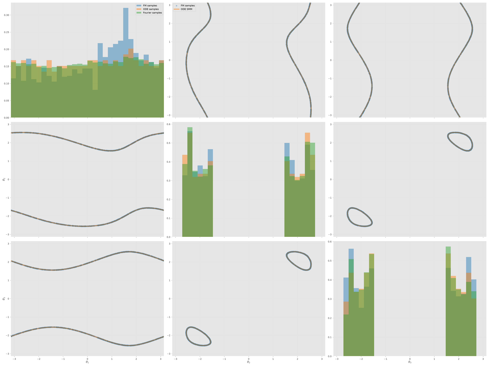
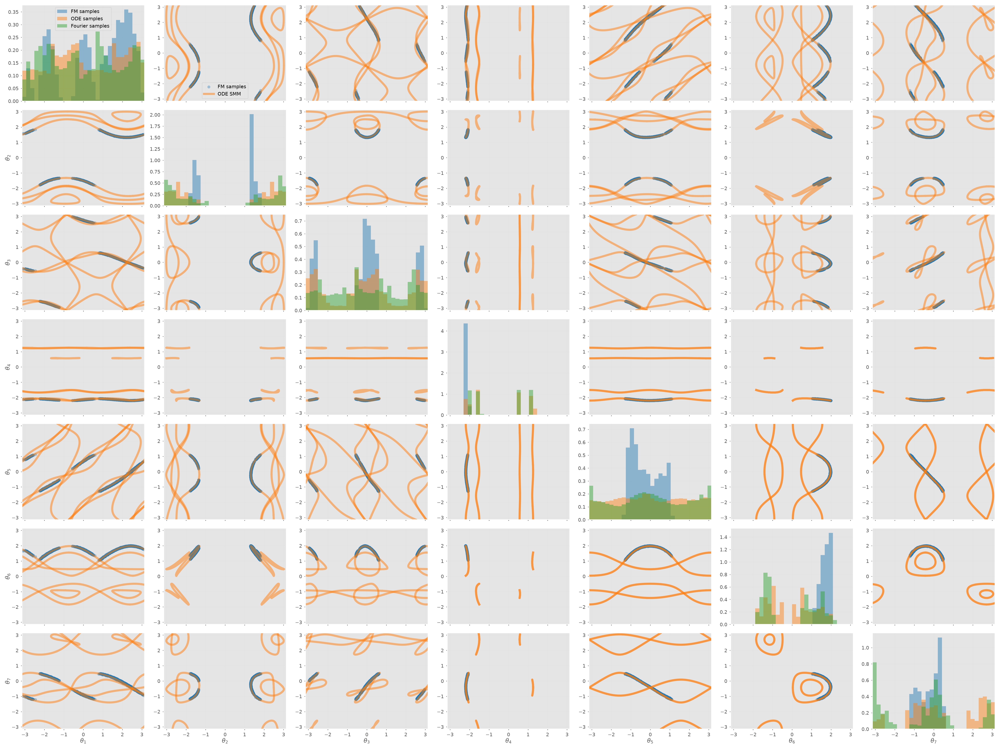
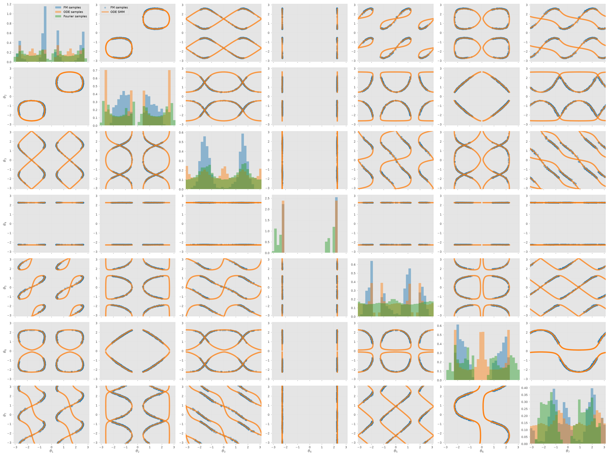
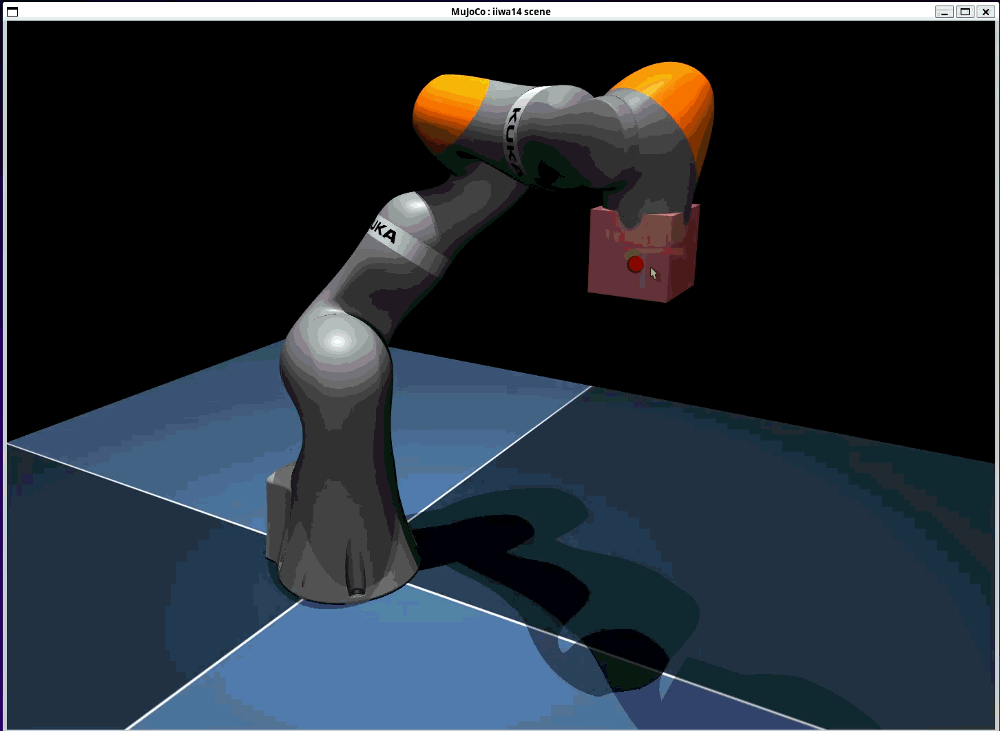
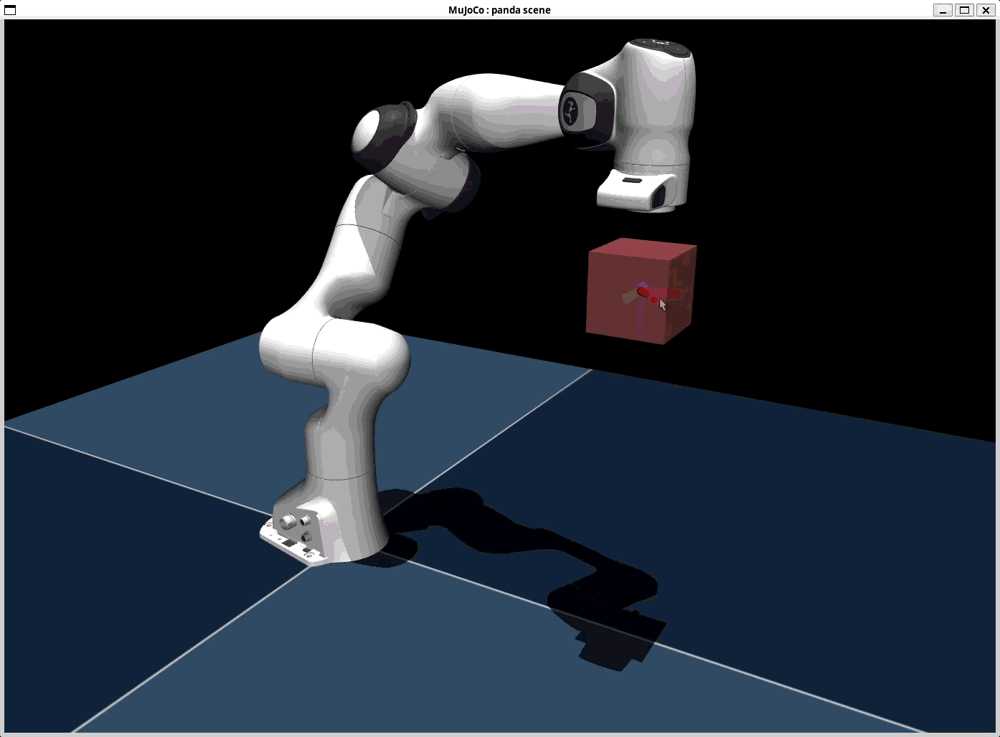
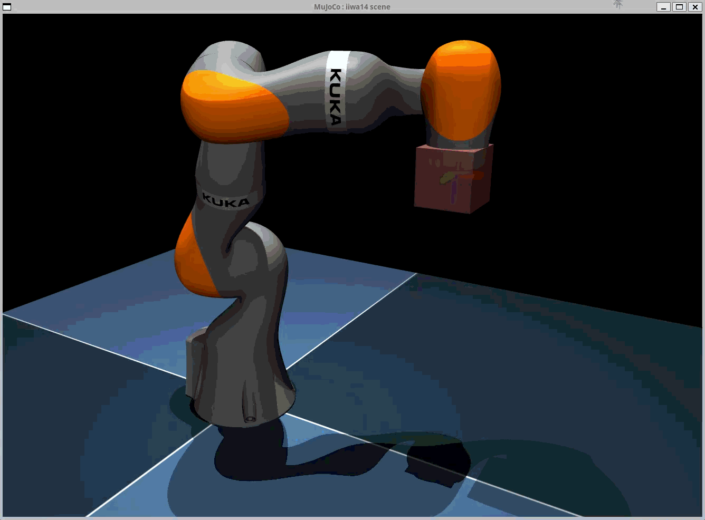
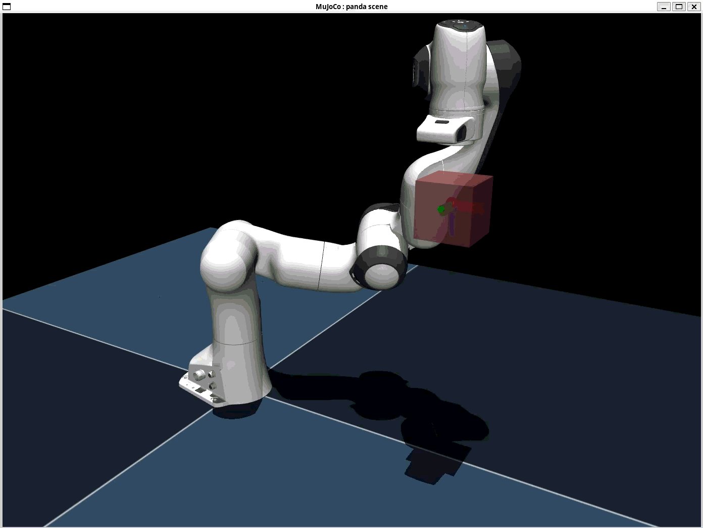
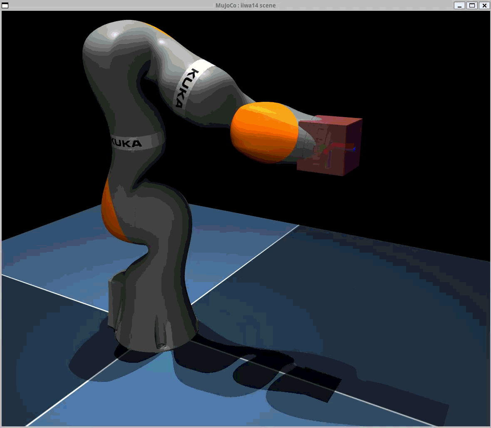
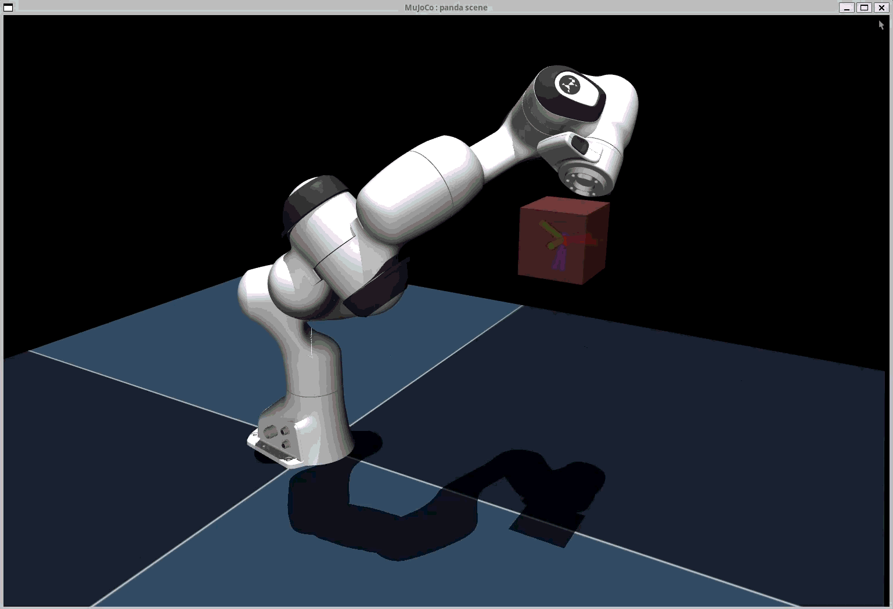

# high-dimenstional-self-motion-manifold-approximation
codebase for my SMM paper

## Run command:
```shell
chmod +x run.sh
./run.sh all
```

## Results
### 3R


### 7R Panda | pose


### 7R iiwa | pose


you can see that all samples from flow-matching model lie on the correct SMMs computed by ODE method. It's a subset of 1-D SMM curves as it's contrainted by **joint limits**

## Generative IK Solutions
| File | Video | Description |
|------|-------|-------------|
|`iiwa_7r_pose.py`||generative ik solutions|
|`panda_7r_pose.py`||generative ik solutions|

## 1-D Self-Motion Manifold
| File | Video | Description |
|------|-------|-------------|
|`iiwa_self_motion.py`||sampling from 1-D SMM curves|
|`panda_self_motion.py`||sampling from 1-D SMM curves|

## 4-D Self-Motion Manifold
It appears when 7DoF robot does positioning jobs
| File | Video | Description |
|------|-------|-------------|
|`iiwa_7r_4d_smm.py`||sampling from 4-D SMM curves|
|`panda_7r_4d_smm.py`||sampling from 4-D SMM curves|


