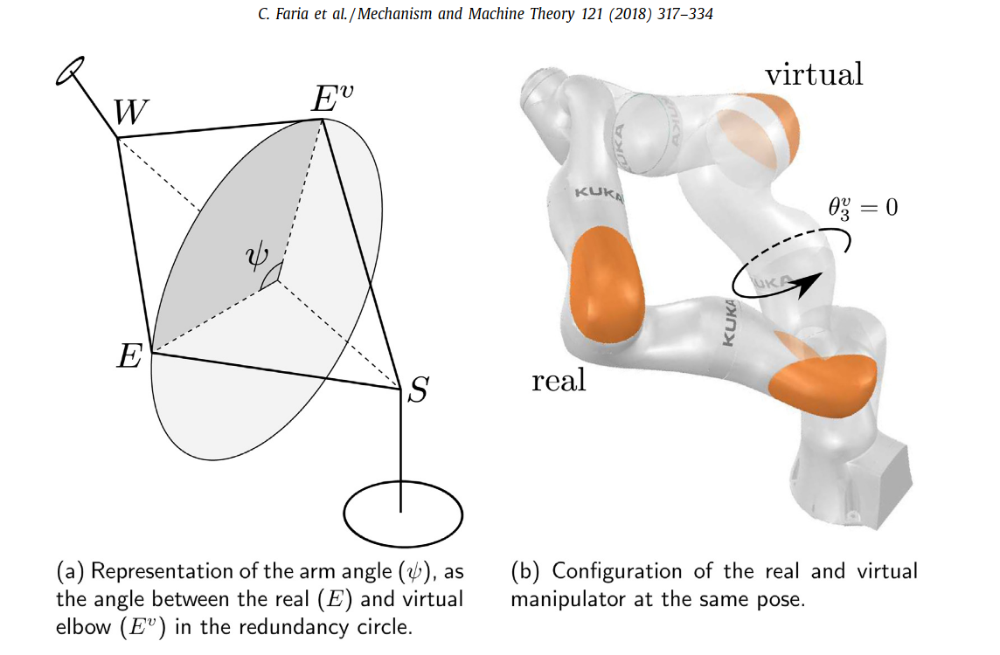
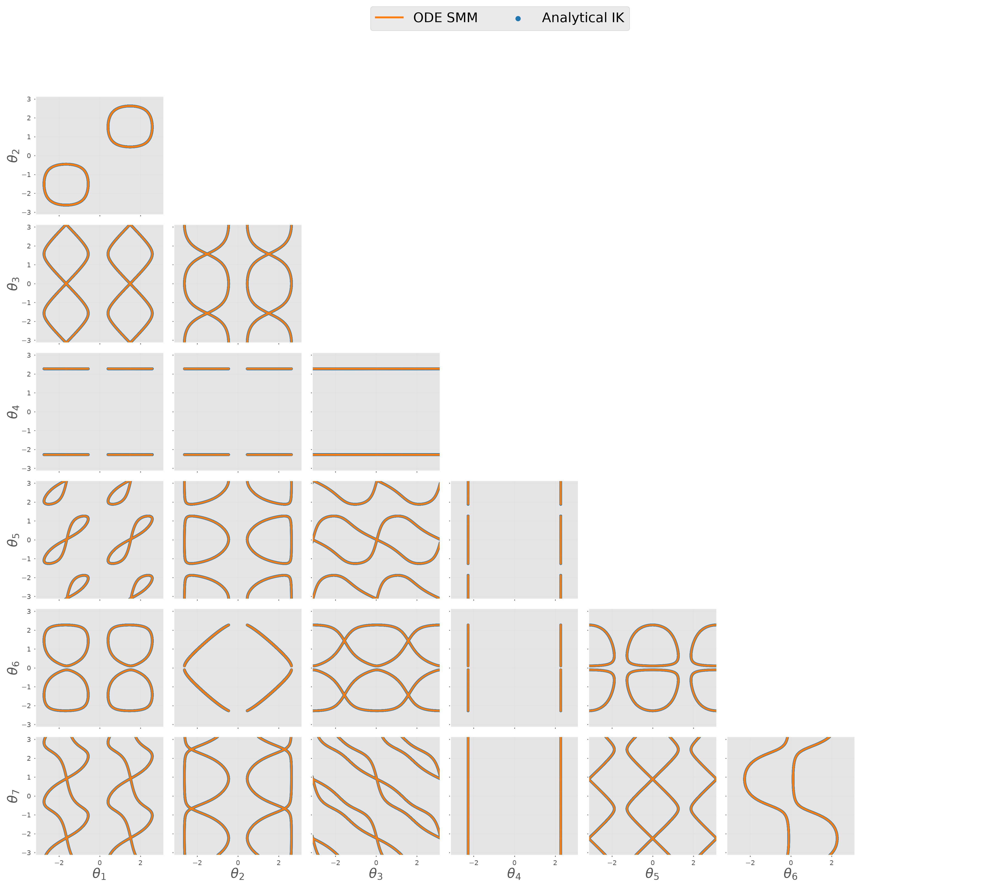
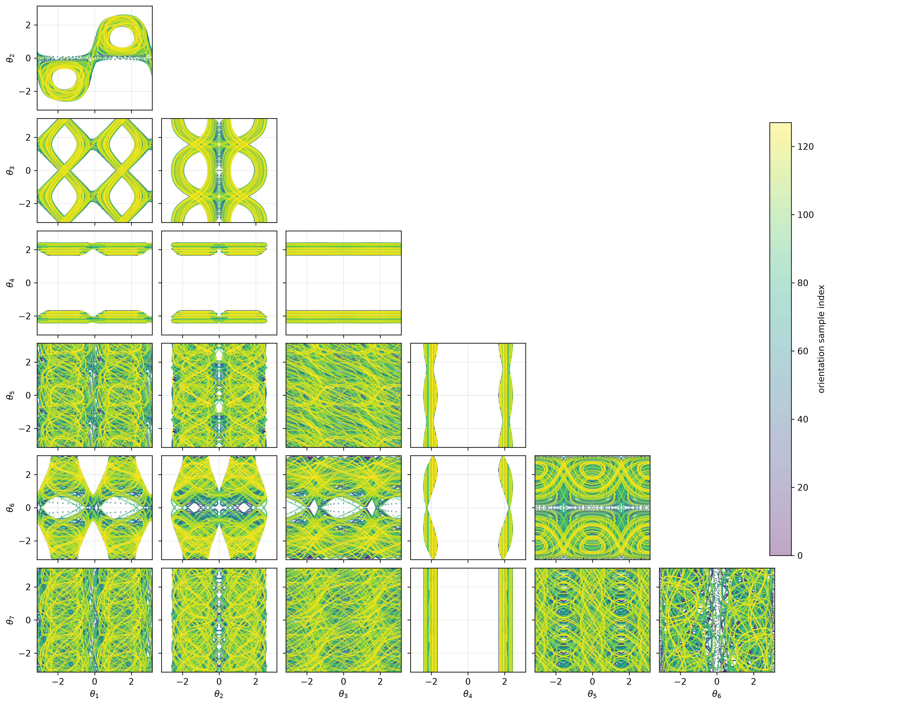
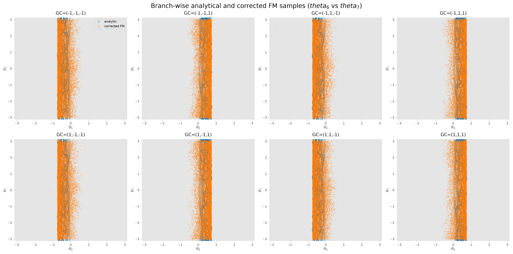
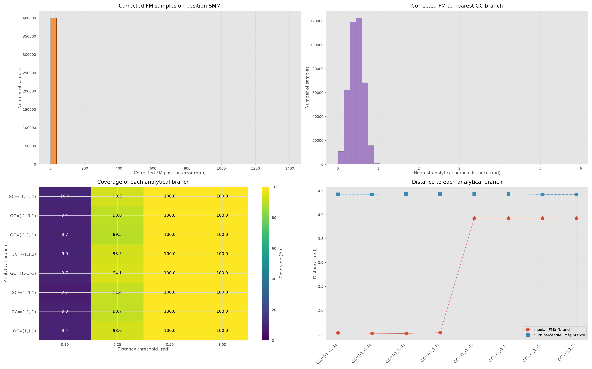

# Analytic IK for 7 DoF Manipulator

For S-R-S structure 7 DoF manipulator like KUKA iiwa 14 and Franka Emika Panda robotic arm, it is possible deriving an analytic IK solutions given a desired target pose $x \in SE(3)$. This can be solved giving a parameterisation $\psi$ which represent the angles between a reference plane and SEW (shoulder-elbow-wrist) plane. This parameter represents the redundant degree, i.e. self-motion manifold.

this figure comes from the [paper](https://www.sciencedirect.com/science/article/pii/S0094114X17306559)

## Analytic IK solver
The implementation is in the folder `analytic_ik/analytic_ik_7dof.py` which used a lot of code based on Cohn's [github repo](https://github.com/cohnt/constraint-manifold-charts-ift).

## Comparison with ODE method
without joint limits, ODE method matches analytical IK solutions parameterised by $\psi$ shown in the following figure

.

## 4-D SMM
There is also a way to compute 4-D SMMs analytically. The main idea is:
1. given a desired position $p \in \mathbb{R}^3$.
2. sample a orientation direction $R \in SO(3)$.
3. compose them to a desired pose $(p, R) \in SE(3)$.
4. solve the IK solutions based on the pose.

We can smaple various $R$ from $SO(3)$ and repeat above algorithm. An example is shown in the figure

## Comparison with FM method in 4-D SMMs
we compare the samples from analytic IK solution with all 8 branches with samples from learned IK model

Quantitatively, it is

