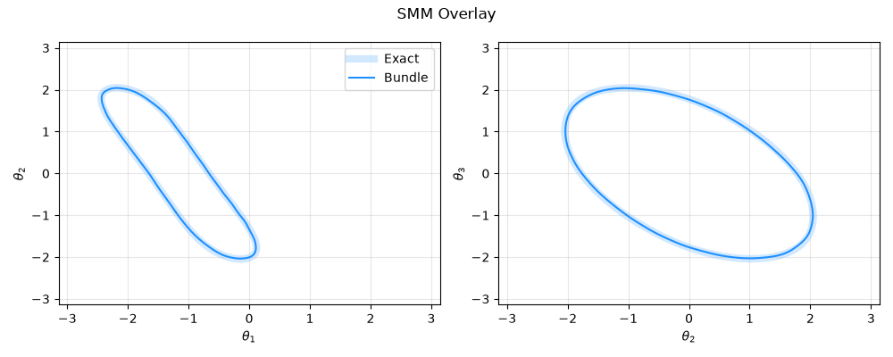

# Fourier Representation Learning for SMM

This folder is a upgraded implementation for "realtime_smm" of the paper: *"A Learning-Based Method for Computing Self-Motion Manifolds of Redundant Robots for  Real-Time Fault-Tolerant Motion Planning"*

## Main Upgrades
- Batched forward kinematics
- faster workspace clustering for high DoF robotic arm, e.g. 7 DoF
- grid clustering reduction
- support Panda, iiwa robots

## Code structure
```text
.
├── batch_kin.py
├── fast_smm.py
├── __pycache__
│   ├── batch_kin.cpython-311.pyc
│   └── fast_smm.cpython-311.pyc
├── README.md
├── robots
│   ├── panda.py
│   ├── planar3r.py
│   └── __pycache__
│       ├── panda.cpython-311.pyc
│       └── planar3r.cpython-311.pyc
├── tests
│   ├── __pycache__
│   │   ├── test_panda.cpython-311.pyc
│   │   └── test_planar3r.cpython-311.pyc
│   ├── test_panda.py
│   └── test_planar3r.py
└── upstream_fk_err.patch
```

## First Run
Try the `tests.test_panda.py` file first in which it shows the main updates and advantages of this new implementation.
```text
--- kinematics --------------------------------------------------
max |FK  - rtb.models.Panda|    = 3.99e-04
max |J   - rtb.jacob0|          = 3.99e-04
Ts shape: (50, 4, 4)
max |FK  - realtime_smm.Robot|  = 0.00e+00
max |J   - realtime_smm.Robot|  = 0.00e+00

--- orientation-frame bug in the released Robot.fk_err ----------
IK convergence, released fk_err  log(R_c^T R_d): 0/10
IK convergence, fixed   fk_err  log(R_d R_c^T): 10/10

--- symmetries used for the grid reduction ----------------------
max |Rz(a).T(q) - T(q + a.e1)|  = 4.44e-16
max |T(q).Rz(b) - T(q + b.e7)|  = 2.22e-16
  (the second one is what the released package does not exploit)

--- null space: eq. (6) minors vs QR ----------------------------
max |1 - |<n_eq6, n_qr>||        = 4.44e-16
max |J n| = 2.28e-15

--- batched SMM solver vs reference solver ----------------------
branches  batched   = [0, 8, 8, 8, 8, 8, 8, 4, 8, 4, 4, 7, 4, 8, 8, 8, 8, 8, 8, 8, 8, 4, 4, 8, 4, 8, 7, 4, 4, 8, 8, 4, 4, 4, 4, 8, 8, 8, 8, 8, 0, 4, 8, 8, 4, 8, 4, 8, 4, 8]
branches  reference = [0, 8, 8, 8, 8, 8, 8, 4, 8, 4, 4, 8, 4, 8, 8, 8, 8, 8, 8, 8, 8, 4, 4, 8, 4, 8, 8, 4, 4, 8, 8, 4, 4, 4, 4, 8, 8, 8, 8, 0, 0, 4, 8, 8, 4, 8, 4, 8, 4, 8]
time/pose batched   = 0.261 s
time/pose reference = 1.504 s   ->  6x
  traced SMM FK error mean 0.1282 %
```
with 6x times faster is amazing!!!. The more samples, the faster.

## 3R manipulator for 2-D planar motion


```text
Fourier-series SMM raw output (10000/10000 reachable targets, 1437312 configs): mean 0.591% | median 0.446% | max 19.1%
  + 3 Jacobian IK-correction steps: mean 0.000269% | median 9.48e-14% | max 69.2%
```

## 7R Panda for 6-D pose motion


